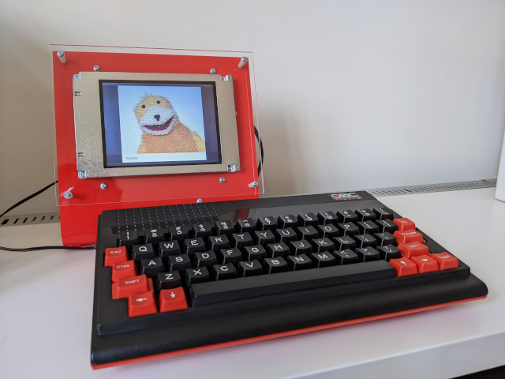

# flatoric

The answer to a question that nobody ever asked. A flat panel display for the Oric-1/Atmos series of microcomputers! Originally developed as a learning exercise in VHDL, now re-written and enhanced in Verilog for your delectation.

The design targets a Xilinx XC2S256 CPLD, plus a 32 kB SRAM and Toshiba SX14Q001 5.7" LCD panel. This repository contains all files required to simulate and/or synthesize the design using the Xilinx ISE tools, which are available to download free of charge, should you feel inclined.

Yep, I actually built it.